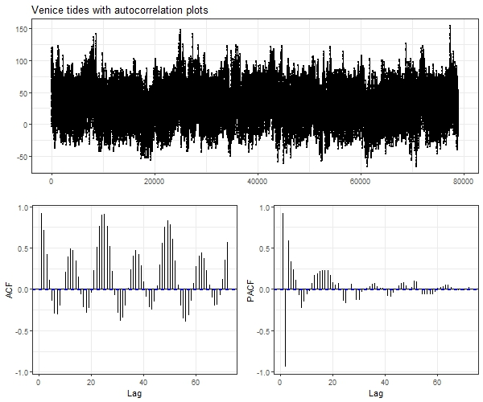
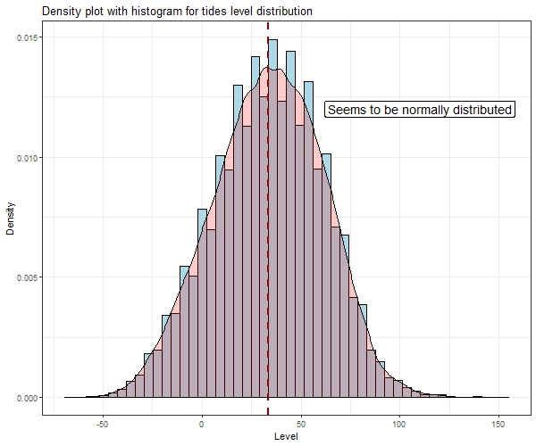
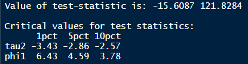
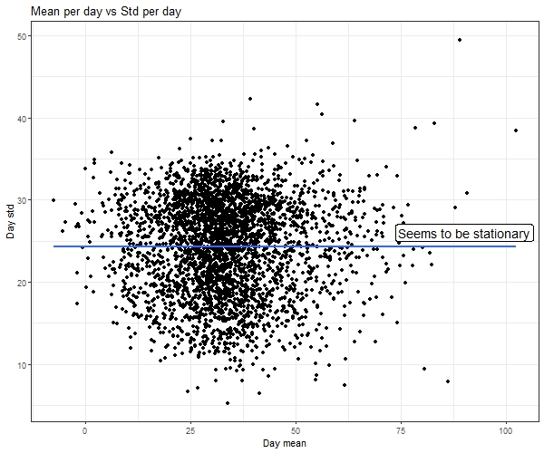
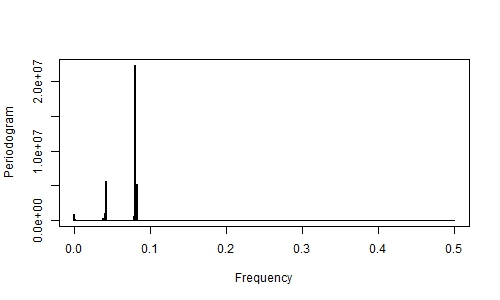
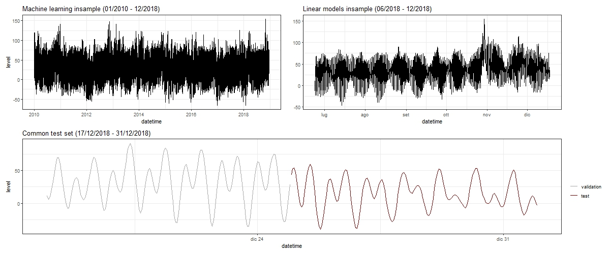
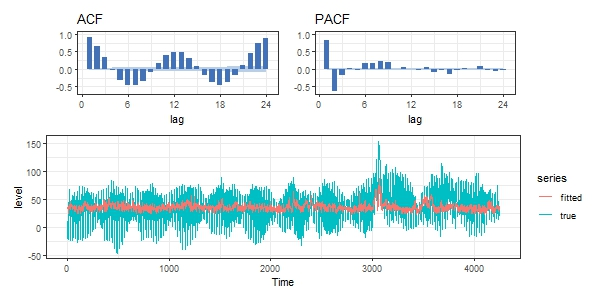
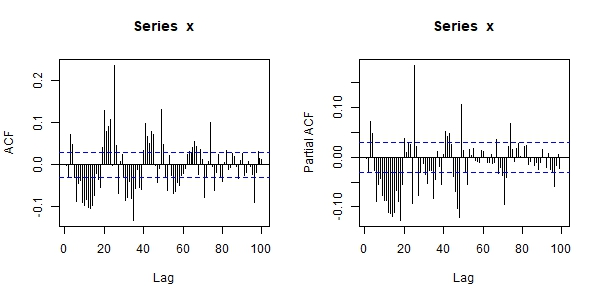
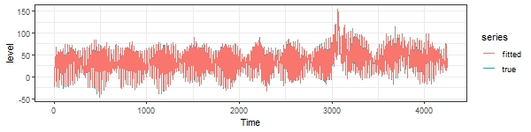
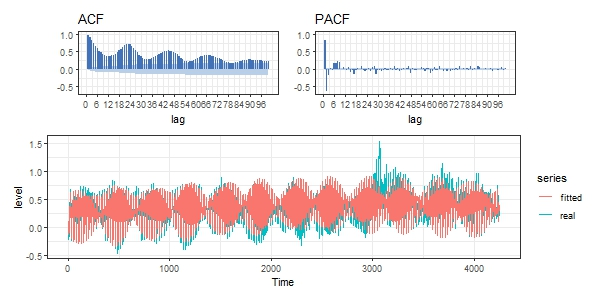

```{r knitr_init, echo=FALSE, cache=FALSE}
library(knitr)
library(rmdformats)
library(shiny)

## Global options
options(max.print="75")
opts_chunk$set(echo=FALSE,
	             cache=TRUE,
               prompt=FALSE,
               tidy=TRUE,
               comment=NA,
               message=FALSE,
               warning=FALSE)
opts_knit$set(width=75)
```

<style>
body{
text-align:justify
}
</style>

# Abstract

The main objective of the project is to analyze the data of the tide detections regarding the area of the Venice lagoon, producing predictive models whose performances are evaluated on a time horizon ranging from one hour up to a week of forecast.

For this purpose, three models, both linear and machine-learning based, are tested:

* ARIMA (AutoRegressive Integrated Moving Average);
* UCM (Unobserved Component Models);
* LSTM (Long Short-Term Memory).

# Datasets

Two datasets are the basis for the project pipeline: 

  - the "main" dataset contains the tides level measurements (in cm) in the Venice lagoon from a certain reference level, obtained through the use of a sensor, between 1983 and 2018;
  - a second dataset holds the information regarding meteorological variables such as rainfall in mm, wind direction in degree at 10 meters and finally wind speed at 10 meters in meters per second in the periods between 2000 and 2019.

<!-- I dataset utilizzati per lo svolgimento della pipeline del progetto sono sostanzialmente due: un primo dataset composto dalle rilevazioni, tramite un apposito sensore, dei livelli di marea nella laguna di Venezia in cm rispetto ad un certo valore di riferimento dal 1983 fino al 2018 mentre il secondo contiene le informazioni riguardanti variabili meteorologiche (precipitazioni in millimetri, direzione del vento in gradi, velocità del vento in Km/h) dal 2000 al 2019. -->

The tides level dataset is composed using the single historical datasets made public by the city of Venice, in particular from [Centro Previsioni e Segnalazioni Maree](https://www.comune.venezia.it/node/6214). The data regarding the meteorological variables, instead have been provided, on request, by [ARPA Veneto](https://www.arpa.veneto.it/). 

All the preprocessing operations regarding parsing, inspection and the final union of the cited datasets are available in the following scripts:

<!-- 
/html realized with this order:
Il dataset dei livelli di marea è stato composto dai singoli dataset storici annuali forniti dal Comune di Venezia, in particolare dal [Centro Previsioni e Segnalazioni Maree](https://www.comune.venezia.it/node/6214). I dati riguardanti invece le variabili meteorologiche sono stati forniti, su richiesta, da [ARPA Veneto](https://www.arpa.veneto.it/). Tutte le operazioni di preprocessing riguardanti l'assemblaggio, l'ispezione e la conclusiva unione dei dataset citati sono disponibili nei seguenti script/html realizzati con questo ordine: -->

* **parsing_tides_data** allows to perform the construction of the tidal dataset, importing and unifying each single annual dataset;

<!-- è lo script utilizzato per svolgere l'operazione di assemblaggio del dataset delle maree completo, importando ed unificando tutti i dataset annuali disponibili;

-->

* **inspection** contains a series of preliminar inspection of the aformentioned data:

<!-- contiene una serie di ispezioni preliminari rispetto i dati citati;
-->

* **preprocess_weather_data_2000_2019** contains the preprocessing operations of the weather-related dataset;

<!-- contiene invece le operazioni di processing riguardanti i dati meteorologici;
-->
* **parsing_tides_weather**  reports a summary of the procedure implemented in order to deal with missing data in the weather dataset, and contains the merging operation producing the final weather dataset.

<!-- riassume infine le operazioni svolte per risolvere il problema dei dati mancanti per quanto riguarda il dataset dei dati meteorologici ed il finale *merge* dei due file.
-->
As a precise choice, due to time-related and computational reasons, only the data ranging from 2010 and 2018 are kept after the preprocessing.
<!--
Come scelta progettuale, si è deciso in fase di processing dei dati di limitare l'utilizzo di questi al periodo tra Gennaio 2010 e Dicembre 2018.
-->

# Data inspection

During the preprocessing phase, some descriptive visualizations regarding the main time series are produced in order to inspect its characteristics.  
<!--
Durante la fase di processing dei dati e prima di procedere all'effettiva realizzazione dei modelli di previsione, sono state prodotte una serie di visualizzazioni con lo scopo di ispezionare a fondo alcuni aspetti riguardanti la serie storica. 
-->

<center>
<figure>

<figcaption>Figure 1: Time serie visualization with autocorrelation and partial autocorrelation plots</figcaption>
</figure>
</center>
<br>

<!--
In fig. 1 è possibile osservare la serie storica completa, rappresentata insieme ai plot di autocorrelazione ed autocorrelazione parziale, mentre in fig. 2 si può verificare come il fenomeno delle maree sembrerebbe distribuirsi seguendo una distribuzione normale. In questo caso, infatti, i concetti di stazionarietà debole e forte si equivalgono.
-->

<center>
<figure>

<figcaption>Figure 2: Time serie distribution</figcaption>
</figure>
</center>
<br>
<!--
Durante il lavoro di prima ispezione dei dati storici una delle verifiche effettuate ha riguardato la stazionarietà in media e quella in varianza: per quanto riguarda la prima osservando la serie in fig. 1 questa sembrerebbe effettivamente risultare stazionaria in media, per questa ragione per confermare l'ipotesi di stazionarietà in fig. 3 è riportato l'output di un test Augmented Dickey-Fuller che, come si vede, conferma a tutti gli effetti la stazionarietà in media del fenomeno mareale.
-->
<center>
<figure>

<figcaption>Figure 3: output test ADF</figcaption>
</figure>
</center>
<br>
<!--
Successivamente alla verifica della stazionarità in media si è proceduto a verificare la stazionarietà in varianza: appare chiaro dal plot riportato in fig. 4 come i valori medi di marea per giorno e la loro *standard deviation* non risultino in un trend crescente ma anzi seguano sostanzialmente un trend piatto.
-->
<center>
<figure>

<figcaption>Figure 4: Visualization of stationarity in variance</figcaption>
</figure>
</center>
<br>

<center>
<figure>

<figcaption>Figure 5: Frequency visualization using periodogram</figcaption>
</figure>
</center>
<br>

# Models

As anticipated, the models created will focus on two areas, one more purely statistical with linear models such as ARIMA and UCM and the other of machine learning, through the definition of an LSTM model. The preparations and implementations of the models will be presented below and finally a section of results will be proposed in which it will be possible to make a rapid comparison between the performance of the models on a test set defined a priori. Referring to that, it is worth highlighting the data used for both areas:

<!-- Come anticipato, i modelli realizzati vertono su due ambiti, uno più puramente statistico di modelli lineari ovvero ARIMA ed UCM e l'altro di machine learning, attraverso la definizione di un modello LSTM. Di seguito verranno presentati i preparativi e le implementazioni dei modelli ed infine verrà proposta una sezione di risultati in cui sarà possibile effettuare un rapido confronto tra le prestazioni dei modelli su un test set definito a priori. A questo proposito vale la pena di sottolineare i dati utilizzati per entrambi gli ambiti: -->

* for the linear models the training set is composed by the last six months of 2018, from July to December;
* for the machine learning one, considering the capacity of handle more data with constant computational time, the training set cover the period between January 2010 and December 2018.

The test set, previously extracted, refer to the last two weeks of December 2018, i.e. from 17/12/2018 23:00:00 to 31/12/2019 23:00:00.

<!-- * per i modelli lineari il training set consiste negli ultimi sei mesi del 2018, a partire da Luglio fino a Dicembre 2018; -->
<!-- * per il modello machine learning, data la sua capacità di gestire moli di dati decisamente superiori a parità di tempo di computazione, come training set è stato utilizzato tutto il dataset a partire da Gennaio 2010 fino a Dicembre 2018. -->

<!-- Il test set, estratto a priori, consiste nell'ultima settimana di Dicembre 2018, ovvero dal 24/12/2018 23:00:00 al 31/12/2018 alle 23:00:00. -->

<center>
<figure>

<figcaption>Figure 6: Train and test data representation</figcaption>
</figure>
</center>
<br>
<!-- Entrambi i modelli lineari realizzati, come detto, utilizzano come training set i dati delle maree a partire dal 01/07/2018 00:00:00 fino al 24/12/2018 23:00:00. Questa scelta è stata guidata da esigenze di ottimizzazione dei tempi di *fitting* dei modelli poichè, selezionando più dati, si è riscontrato un importante dilatamento di questi. Sia ARIMA che UCM sono stati scritti in R, utilizzando a questo scopo i pacchetti *forecast* e *KFAS*. -->

With reference to the linear models, two strategies are implemented: the former consist in integrate the meteorological variables with the lunar motion while the latter in extracting the principal periodic components exploiting *oce*, an R package that helps Oceanographers do their work by providing functions to read Oceanographic data files.

Regarding the first strategy, after processing the meteorological data as previously mentioned, using the API *PyEphem*, an astronomy library that provides basic astronomical computations for the Python programming language. Given a date and location on the Earth’s surface, it can compute the positions of the Sun and Moon, of the planets and their moons, and of any asteroids, comets, or earth satellites whose orbital elements the user can provide. In order to track the lunar motion all we have to do is to select the period of interest and the coordinates representing Venice.

<div align="center">
<figure>
```{r out.width="60%", tidy=TRUE}
shiny::includeHTML("imgs/test.html")
```
<figcaption>Figure 7: Interactive plot representing lunar motion between 2010 and 2018</figcaption>
</figure>
</div>
<br>
The second strategy instead, as anticipated, concerns the principal periodic components extractable from a time series about sea levels in order to be used as regressors for the tides level time serie. The *oce* package provide a function called *tidem* able to fit a model in terms of sine and cosine components at the indicated tidal frequencies, with the amplitude and phase being calculated from the resultant coefficients on the sine and cosine terms. *Tidem* provides the possibility to extract till 69 components but we focused on 8 of them, in particular:

* M2, main lunar semi-diurnal with a period of ~12 hours;
* S2, main solar semi-diurnal (~12 hours);
* N2, lunar-elliptic semi-diurnal (~13 hours);
* K2, lunar-solar semi-diurnal (~12 hours);
* K1, lunar-solar diurnal (~24 hours);
* O1, main lunar diurnal (~26 hours);
* SA, solar annual (~24*365 hours);
* P1, main solar diurnal (24 hours).

<div align="center">
<figure>
```{r, out.width="60%"}
shiny::includeHTML("imgs/components.html")
```
<figcaption>Figure 8: Interactive filtering plot for the extracted components</figcaption>
</figure>
</div>

## ARIMA

Both the realized linear models use the data between 25/06/2018 00:00:00 and 17/12/2018 23:00:00 as training set. This choice was determined by the needs of optimizing the models' fitting time because, taking more data, there was an important temporal expansion. Both ARIMA and UCM are programmed using R, in particular with *forecast* and *KFAS* packages.

As first approach to the forecast task we trained two ARIMA models: the former is trained using as regressors the meteorological data provided by ARPA Veneto with the lunar motion obtained using *PyEPhem* while the latter using the 8 harmonics from the use of *oce* and *tidem*.

Starting from the first model created it's worth to notice that the meteorological data have been standardized and the lunar motion, as seen in literature, is taken with the following form:

\begin{equation}
lunar\_var = \frac{1}{lunar\_motion^2}
\end{equation}

The first impact of the variables is substantially insignificant as is possible to see in fig. 9, the correlations and the partial correlations mantain their magnitude and the fitting on the training data is weak.

<center>
<figure>

<figcaption>Figure 9: First output from ARIMA 1</figcaption>
</figure>
</center>
<br>

After several attemps, following the represented Lag on ACF and PACF plots in combination with the value of the AICc and the Mean Absolute Percentage Error (MAPE), a highly parameterized model has been reached with the form (3,1,3)(1,1,3)[24]. Although the autocorrelation has not been completely absorbed, the Box-Ljung test indicates that it is no longer present for the first few hours. The fitting on the training set also improves considerably and the performance on the test proves to be quite good as will be illustrated below. The autocorrelation and the fitting performances are visible in fig. 10.

<center>
<figure>


<figcaption>Figure 10: Final output from ARIMA 1</figcaption>
</figure>
</center>
<br>
As anticipated, the second ARIMA model realized use as input regressors the 8 harmonics extracted using *tidem* and *oce*. Since it is a functional form based solely on time, it is possible for us to obtain them also for the projections. An example of this harmonics is shown in fig. 8 in an interactive fashion. The effect of the use of harmonics is already visible starting from the basic model, that is, the one without autoregressive components or moving average.

<center>
<figure>

<figcaption>Figure 11: Final output from ARIMA 1</figcaption>
</figure>
</center>
<br>

## UCM

## LSTM

Inserire qui procedimento svolto LSTM