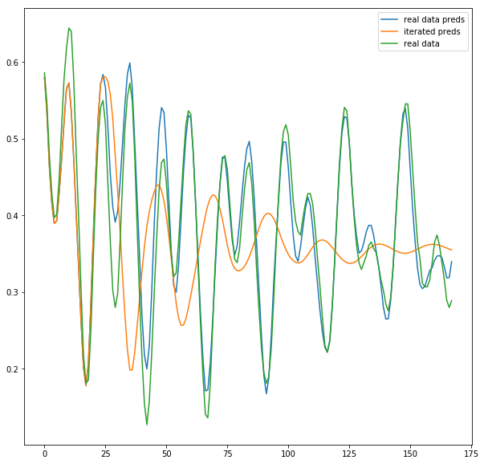

```{r knitr_init, echo=FALSE, cache=FALSE}
library(knitr)
library(rmdformats)
library(shiny)

## Global options
options(max.print="75")
opts_chunk$set(echo=FALSE,
	             cache=TRUE,
               prompt=FALSE,
               tidy=TRUE,
               comment=NA,
               message=FALSE,
               warning=FALSE)
opts_knit$set(width=75)
```

<style>
body{
text-align:justify
}
</style>

# Abstract

The main objective of the project is to analyze the data of the tide detections regarding the area of the Venice lagoon, producing predictive models whose performances are evaluated on a time horizon ranging from one hour up to a week of forecast.

For this purpose, three models, both linear and machine-learning based, are tested:

* ARIMA (AutoRegressive Integrated Moving Average);
* UCM (Unobserved Component Models);
* LSTM (Long Short-Term Memory).

# Datasets

Two datasets are the basis for the project pipeline: 

  - the "main" dataset contains the tides level measurements (in cm) in the Venice lagoon from a certain reference level, obtained through the use of a sensor, between 1983 and 2018;
  - a second dataset holds the information regarding meteorological variables such as rainfall in mm, wind direction in degree at 10 meters and finally wind speed at 10 meters in meters per second in the periods between 2000 and 2019.

<!-- I dataset utilizzati per lo svolgimento della pipeline del progetto sono sostanzialmente due: un primo dataset composto dalle rilevazioni, tramite un apposito sensore, dei livelli di marea nella laguna di Venezia in cm rispetto ad un certo valore di riferimento dal 1983 fino al 2018 mentre il secondo contiene le informazioni riguardanti variabili meteorologiche (precipitazioni in millimetri, direzione del vento in gradi, velocità del vento in Km/h) dal 2000 al 2019. -->


The tides level dataset is composed using the single historical datasets made public by the city of Venice, in particular from [Centro Previsioni e Segnalazioni Maree](https://www.comune.venezia.it/node/6214). The data regarding the meteorological variables, instead have been provided, on request, by [ARPA Veneto](https://www.arpa.veneto.it/). 

Considering that one of the main cause of the tidal phenomena is known to be the lunar gravitational potential acting over the seas on earth, an attempt was made in order to explicitly introduce in the model the physics of the system through the creation of an ad-hoc time series containing the distance between Venice and the Moon (i.e. the radius of the gravitational interaction). Therefore, we firstly reproduced the approximate solution of the (differential) motion equation governing the lunar motion around the earth (as a Sun-Earth-Moon three body problem) presented in the great book "Newtonian Dynamics" by Richard Fitzpatrick, obtaining a quite precise analytical description of the aforementioned interaction radius, calculated with respect to the center of the earch, as a function of time.
Then, in order to access more precise solutions, and for the sake of simplicity and re-using fashion' we exploited the API *PyEphem*, an astronomy library that provides basic astronomical computations for the Python programming language: the objective distance is obtained from the API which internally perform a 4th order RK integration and triangulate the distance with respect to the observer position (Venice in this case).
In summary, the "*lunar motion*" time series, consisting of the distance between Venice and the Moon as a function of time, is obtained for further testing's sake.

All the preprocessing operations regarding parsing, inspection and the final union of the cited datasets are available in the following scripts:

<!-- 
/html realized with this order:
Il dataset dei livelli di marea è stato composto dai singoli dataset storici annuali forniti dal Comune di Venezia, in particolare dal [Centro Previsioni e Segnalazioni Maree](https://www.comune.venezia.it/node/6214). I dati riguardanti invece le variabili meteorologiche sono stati forniti, su richiesta, da [ARPA Veneto](https://www.arpa.veneto.it/). Tutte le operazioni di preprocessing riguardanti l'assemblaggio, l'ispezione e la conclusiva unione dei dataset citati sono disponibili nei seguenti script/html realizzati con questo ordine: -->

* **parsing_tides_data** allows to perform the construction of the tidal dataset, importing and unifying each single annual dataset;

<!-- è lo script utilizzato per svolgere l'operazione di assemblaggio del dataset delle maree completo, importando ed unificando tutti i dataset annuali disponibili;

-->

* **inspection** contains a series of preliminar inspection of the aformentioned data:

<!-- contiene una serie di ispezioni preliminari rispetto i dati citati;
-->

* **preprocess_weather_data_2000_2019** contains the preprocessing operations of the weather-related dataset;

<!-- contiene invece le operazioni di processing riguardanti i dati meteorologici;
-->
* **parsing_tides_weather**  reports a summary of the procedure implemented in order to deal with missing data in the weather dataset, and contains the merging operation producing the final weather dataset.

<!-- riassume infine le operazioni svolte per risolvere il problema dei dati mancanti per quanto riguarda il dataset dei dati meteorologici ed il finale *merge* dei due file.
-->
As a precise choice, due to time-related and computational reasons, only the data ranging from 2010 and 2018 are kept after the preprocessing.
<!--
Come scelta progettuale, si è deciso in fase di processing dei dati di limitare l'utilizzo di questi al periodo tra Gennaio 2010 e Dicembre 2018.
-->

# Data inspection

During the preprocessing phase, some descriptive visualizations regarding the main time series are produced in order to inspect its characteristics.  
<!--
Durante la fase di processing dei dati e prima di procedere all'effettiva realizzazione dei modelli di previsione, sono state prodotte una serie di visualizzazioni con lo scopo di ispezionare a fondo alcuni aspetti riguardanti la serie storica. 
-->

<center>
<figure>

<figcaption>Figure 1: Time serie visualization with autocorrelation and partial autocorrelation plots</figcaption>
</figure>
</center>
<br>

Fig.1 reports the entire time series, represented together with the autocorrelation and partial autocorrealtion plots. 
Observing Fig.2, it is possible to notice how the tidal phenomenon seems to be characterized by a normal distribution. In such a case, it is worth noticing that from the analytic perspective the concepts of strict and weak stationarity are equivalent. 

<!--
In fig. 1 è possibile osservare la serie storica completa, rappresentata insieme ai plot di autocorrelazione ed autocorrelazione parziale, mentre in fig. 2 si può verificare come il fenomeno delle maree sembrerebbe distribuirsi seguendo una distribuzione normale. In questo caso, infatti, i concetti di stazionarietà debole e forte si equivalgono.
-->

<center>
<figure>

<figcaption>Figure 2: Time serie distribution</figcaption>
</figure>
</center>
<br>
During the preliminary inspection of the historycal data, one of the investigations deals with  the mean and variance stationarity of the considered time series.
Regarding the former,  Fig.1 suggests the series to be characterized by a stationary mean. This hypothesis is further proven by the output of the Augmented Dickey-Fuller test, confirming the in-mean stationarity of the tidal phenomenon.
<!--
Durante il lavoro di prima ispezione dei dati storici una delle verifiche effettuate ha riguardato la stazionarietà in media e quella in varianza: per quanto riguarda la prima osservando la serie in fig. 1 questa sembrerebbe effettivamente risultare stazionaria in media, per questa ragione per confermare l'ipotesi di stazionarietà in fig. 3 è riportato l'output di un test Augmented Dickey-Fuller che, come si vede, conferma a tutti gli effetti la stazionarietà in media del fenomeno mareale.
-->

<center>
<figure>

<figcaption>Figure 3: output test ADF</figcaption>
</figure>
</center>
<br>
On the other hand, the latter characteristics (stationary variance) can be verified observing Fig.4, where the daily average of the tidal level values are plotted against the daily aggregation of the standard deviation. 
In particular, no clear trends emerges in such a plot, enforcing the conclusion that the plotted quantities are uncorrelated.

<!--
Successivamente alla verifica della stazionarità in media si è proceduto a verificare la stazionarietà in varianza: appare chiaro dal plot riportato in fig. 4 come i valori medi di marea per giorno e la loro *standard deviation* non risultino in un trend crescente ma anzi seguano sostanzialmente un trend piatto.
-->
<center>
<figure>

<figcaption>Figure 4: Visualization of stationarity in variance</figcaption>
</figure>
</center>
<br>

<!--FIXME: add a brief comment to Fig.5 
i.e.: An initial inverstigation is performed by analyzing the main stagionalities of the time series by means of a Correlogram Plot, reported in Fig.5.

but feel free to elaborate-->
<center>
<figure>

<figcaption>Figure 5: Frequency visualization using periodogram</figcaption>
</figure>
</center>
<br>

# Models

The produced models will focus on two areas, a purely statistical one with linear models such as ARIMA and UCM and a a machine learning approach, through the investigation of an LSTM model. 
The preparation and implementation of the models will be presented below and a section of results, where it will be possible to make a rapid comparison between the performance of the models on a test set defined a priori, will be eventually proposed. 
For the modelling approach, it is worth highlighting the different subsets of the whole dataset exploited for each one of the described areas:

<!-- Come anticipato, i modelli realizzati vertono su due ambiti, uno più puramente statistico di modelli lineari ovvero ARIMA ed UCM e l'altro di machine learning, attraverso la definizione di un modello LSTM. Di seguito verranno presentati i preparativi e le implementazioni dei modelli ed infine verrà proposta una sezione di risultati in cui sarà possibile effettuare un rapido confronto tra le prestazioni dei modelli su un test set definito a priori. A questo proposito vale la pena di sottolineare i dati utilizzati per entrambi gli ambiti: -->

* for the linear models the training set is composed by the last six months of 2018, from July to December;
* for the machine learning approach, considering the capability of handling more data within a non-explosive  computational time, the training set covers the period between January 2010 and December 2018. 

The test set, previously extracted, is common among the different approaches and consists of the last two weeks of December 2018, i.e. from 17/12/2018 23:00:00 to 31/12/2019 23:00:00.

<!-- * per i modelli lineari il training set consiste negli ultimi sei mesi del 2018, a partire da Luglio fino a Dicembre 2018; -->
<!-- * per il modello machine learning, data la sua capacità di gestire moli di dati decisamente superiori a parità di tempo di computazione, come training set è stato utilizzato tutto il dataset a partire da Gennaio 2010 fino a Dicembre 2018. -->

<!-- Il test set, estratto a priori, consiste nell'ultima settimana di Dicembre 2018, ovvero dal 24/12/2018 23:00:00 al 31/12/2018 alle 23:00:00. -->

<center>
<figure>

<figcaption>Figure 6: Train and test data representation</figcaption>
</figure>
</center>
<br>
<!--FIXME: got till here-->
<!-- Entrambi i modelli lineari realizzati, come detto, utilizzano come training set i dati delle maree a partire dal 01/07/2018 00:00:00 fino al 24/12/2018 23:00:00. Questa scelta è stata guidata da esigenze di ottimizzazione dei tempi di *fitting* dei modelli poichè, selezionando più dati, si è riscontrato un importante dilatamento di questi. Sia ARIMA che UCM sono stati scritti in R, utilizzando a questo scopo i pacchetti *forecast* e *KFAS*. -->

Concerning the linear models, two strategies are considered: the former consists of integrating the meteorological variables and the lunar motion -visualized in Fig.7- in the main analysis, while the latter is based on performing a sort of harmonic analysis by re-using some of the most common principal periodic components  previously extracted from other studies in the field (i.e. see Consoli et all, 2014 and Abubakar et all, 2019). 
The adaptation of such components to our series is done exploiting *oce*, an R package that helps Oceanographers with their work by providing utils to investigate and elaborate Oceanographic data files.

<div align="center">
<figure>
```{r lunar_motion, out.width="60%", tidy=TRUE}
shiny::includeHTML("imgs/test.html")
```
<figcaption>Figure 7: Interactive plot representing lunar motion between 2010 and 2018</figcaption>
</figure>
</div>
<br>
The second strategy instead, as anticipated, concerns the extraction of principal periodic components  from a time series about sea levels commonly treated in literature, and the re-using of those components as regressors for the tides level time series of Venice. 
The *oce* package provide a function called *tidem* able to fit a model in terms of sine and cosine components at the indicated tidal frequencies, with the amplitude and phase being calculated from the resultant coefficients on the sine and cosine terms. 
*Tidem* provides the possibility to "adapt" up to 69 components but we focused on 8 of them, in particular:

* M2, main lunar semi-diurnal with a period of ~12 hours;
* S2, main solar semi-diurnal (~12 hours);
* N2, lunar-elliptic semi-diurnal (~13 hours);
* K2, lunar-solar semi-diurnal (~12 hours);
* K1, lunar-solar diurnal (~24 hours);
* O1, main lunar diurnal (~26 hours);
* SA, solar annual (~24*365 hours);
* P1, main solar diurnal (24 hours).

<div align="center">
<figure>
```{r components, out.width="60%"}
shiny::includeHTML("imgs/components.html")
```
<figcaption>Figure 8: Interactive filtering plot for the extracted components</figcaption>
</figure>
</div>

## ARIMA

Both the realized linear models use the data between 25/06/2018 00:00:00 and 17/12/2018 23:00:00 as training set. This choice is determined by the needs of optimizing the models' fitting time because, taking more data, there would have been an important computational-time explosion. 
Both ARIMA and UCM are implemented in R, in particular with *forecast* and *KFAS* packages.

As a first approach to the forecast task we trained two ARIMA models: the former is trained using as regressors the meteorological data provided by ARPA Veneto with the lunar motion obtained using *PyEPhem* while the latter using the 8 harmonics from  *oce* and *tidem*.

Starting from the first model, it's worth to notice that the meteorological data have been standardized and the lunar motion is elaborated in the following form, recalling the general shape of the grativational potential (proportional to the inverse of the squared distance):

\begin{equation}
lunar\_var = \frac{1}{lunar\_motion^2}
\end{equation}

The first impact of the variable is substantially insignificant as is possible to observe in Fig.9: the correlations and the partial correlations mantain their magnitude and the fitting on the training data is weak.

<center>
<figure>

<figcaption>Figure 9: First output from ARIMA 1</figcaption>
</figure>
</center>
<br>

After several attemps, following the represented Lag on ACF and PACF plots in combination with the value of the AICc and the Mean Absolute Percentage Error (MAPE), a highly parameterized model has been reached with the form (3,1,3)(1,1,3)[24]. 
Although the autocorrelation has not been completely absorbed, the Box-Ljung test indicates that it is no longer relevant for the first few hours. 
The fitting on the training set also improves considerably and the performance on the test proves to be quite good as it will be illustrated below. 
The autocorrelation and the fitting performances are visible in Fig.10.

<center>
<figure>


<figcaption>Figure 10: Final output from ARIMA 1</figcaption>
</figure>
</center>
<br>
As anticipated, the second ARIMA model realized use as input regressors the 8 harmonics extracted using *tidem* and *oce*. Since it is a functional form based solely on time, it is possible for us to obtain them also for the projections. An example of this harmonics is shown in fig. 8 in an interactive fashion. The effect of the use of harmonics is already visible starting from the basic model, that is, the one without autoregressive components or moving average: the autocorrelation plots and the model fitting on the train set is visibile in fig. 11.

<center>
<figure>

<figcaption>Figure 11: Initial output from ARIMA 2</figcaption>
</figure>
</center>
<br>

Also in this case, following the observations of the autocorrelation plots and the trend of the AICc we proceeded to insert the autoregressive and moving average components until obtaining the final model (3,0,2)(1,0,0)[24] with drift. It is worth to notice how this model is decidedly less parameterized than the previous one: this is due to the fact that the harmonics inserted manage to explain a large part of the historical series by themselves as can be seen from fig. 11. After the fitting the resulting autocorrelation plots appears as reported in fig. 12. Even in this case it was not possible to absorb all the autocorrelation but the Box-Ljung text ensures that the residuals are white noise up to the third lag and the performances on train and test set are pretty good.

<center>
<figure>


<figcaption>Figure 12: Final output from ARIMA 2</figcaption>
</figure>
</center>
<br>

## UCM

As a second typology of models regarding the section of linear models, a UCM model has been implemented, in addition to the ARIMA models already mentioned. Numerous attempts were made for this type of model: first of all an attempt was made to create a model based solely on the UCM components available as trigonometric and dummy seasonality, a trend with all its manifestations (LLT, IRW, RW) together with a stationary cycle, then an attempt was made to use the meteorological variables together with the lunar cycle to try to increase the portion of the time serie explained by the model and finally an attempt was made again using the harmonics calculated using the *oce* package. The best performing model was found to be the one composed of harmonics inserted directly as components together with a trend component, specifically a random walk. 

In this sense it is possible once again to understand how much harmonics can contribute in explaining the level of the tides. Later, as for the ARIMA models, the results of the UCM model will also be shown.

## LSTM

FIXME: forse in effetti aveva senso dividere inizialmente tra "LINEAR MODELS" e "MACHINE LEARNING MODELS", così poi la mia ulteriore sottodivisione ha più zenzo. To be discussed with @Fabriwikam

### General Approach

While approaching the problem under a machine-learning based perspective, one of the most important steps is the formalization of the problem. The time series prediction is modelled in such a way to transform the problem in a purely supervised classification problem: 

- the whole time series is re-shaped into a series of non overlapping windows, containing a fixed number of chronologically adhiacent observations,
- each of those slices is treated as a set of input features (equivalent to a record/row in a common dataset) for a classification problem
- for each window, a classifier predicts the i-th observation after the last input feature.

In particular, coherently with the procedure of the linear models, one step (one hour), 24 steps and 168 steps ahead predictions are performed.

Another slightly different approach would consist in a multi-output prediction (feasible i.e. when experimenting with Neural Networks), where for each window given as input to the classifier, another window of target elements is produced. We tested this approach with output slices having dimensions 12, 24 and 168 (i.e. forecasting half a day, a whole day, or an entire week in the same execturion), but the results were not particularly satisfying (not comparable in a quantitative way with those provided by the linear models). 
The mentioned multi-output approach would probably lead to interesting results when dealing with a vast amount of training data (whereas it is worth to recall that, mainly due to computational reasons, we reduced the total amount of available observation down to few years.).
We, therefore, decided to executed and to report "direct" predictions with a single output.

Regarding the input features, two different strategies has been followed:

- a only-auto-regressive approach, where the model inputs consist exclusively of the past history of the time series (the already-mentioned sliding windows)

- a mixed approach, where the same previously-described sliding window procedure is applied to the weather time series and to the harmonics components, generating an overall input set composed by autoregressive features (the lagged windows) and those features.

A proper training set and a one-week validation set are extracted from the selected data, whereas the last week is hold as a totally independent test set. 
The information about the test-set is never exploited during the definition and the training of any model.

## ML Models

Attempting to deal with the aforementioned classification task, several machine learning models are initially tested over 24-steps ahead forecasting with 24-sized input windows. The machine learning approach is implemented in Python, with the Keras API to TensorFlow.
In particular, a Random Forest classifier, a GRU and an LSTM model (implemented with the same overall "architecture") are briefly implemented, in order to compare the overall performances, reported in table 1.

{width=100%}

The GRU and LSTM performances were similar at a first sight, whereas the classic machine learning classifier seems not to be able to stand in the comparison.

Therefore, further testing and a systematic evaluation of performances is carried out on the LSTM model, whose architecture is reported in the few lines of code in Fig.13.

<center>
<figure>
{width=90%}
<figcaption>Figure 13: Screenshot of the LSTM model implementation. </figcaption>
</figure>
</center>
<br>

## Training and Evalutaion Procedure

Three versions of the selected model is trained over each different prediction step with a common training schedule: the number of epochs is set to 250, with a batch size equals to 256, and Early Stopping is applied, monitoring the (non-)variation of the validation loss, in order to avoid the overfitting. 
For counter-balancing the high model complexity, which would lead to overfit the training set, an intensive use of dropout is exploited during the training phase.
For regularizing the training over the last epochs, a learning rate scheduler is implemented, reducing the learning rate when variation over the validation loss starts to indicate signs of learning instability.
We could typically observe a couple of learning rate reduction (of a factor 0.5x) and the Early Stopping mechanism becoming active after ~100 epochs. 
The minimized loss is chosen to be the Mean Squared Error, but analogous results are obtained while testing mean absolute error and mean absolute percentage error as loss functions.
Some (possibly non-exhaustive) examples of training plots are visible at the following link: https://app.wandb.ai/dbertazioli/venice_is_drowing.

An important hyper-parameter to be carefully chosen for this kind of classification problem is the dimension of the slicing performed over the time series, i.e. the number of input features to be considered.

After some experiments, we choose to use the following window sizes (WS):

- WS = 2 for the 1-step ahead forecast
- WS = 24 for the 24-steps ahead forecast
- WS = 168 for the 168-steps ahead forecast.

Regarding the model evaluation phase, for each model produced (i.e. for each "n" in the n-step ahead predictions), the model performances are evaluated with three different metrics: "mse", "mae", and "mape".
Three different evaluation "schedules" are applied:  we choose to report the *one-shot prediction* error, the "*iterated-over-real-values*" error, and the "*iterated-over-predicted-values*" error.
The first type of metric consists in simply taking the error made while predicting the first observation of the test set. In the second kind of evaluation, we average the error over each predicted observation of the dataset, taking the "real" levels from the test set as input for the LSTM classifier, as would be natural to do dealing with Neural Networks.
The last modality emulates the predictions performed by linear models, and consists of taking the average error over each prediction in the test set having the previously predicted values as inputs (this evaluation is not performed for the 168-steps ahead forecast, since the test set only consists of one week).

<center>
<figure>
{width=60%}
<figcaption>Figure 14: Example of fitting in the 24-steps ahead LSTM predictions on the test set. The green line corresponds to the real observations, the blue line corresponds to the predictions iterated over the real observed values, and the orange line refers to the preditions iterated over previously-predicted values (in a linear-model fashion). </figcaption>
</figure>
</center>
<br>

Fig.14 reports an example of the 24-steps ahead model fitting over the test set. 
One can observe how the "iterated-real" and the "iterated-pred" prediction types provides similar results in the first steps and diverging ones after a certain amount of iterations. This behaviour is expected, considering the cumulation of prediction errors leading to the flattening of the prediction line towards the mean of the time series.

# Results

The results of the described evaluation process are reported in Table 2. We verified the proportionality of the obtained MAPE results with those in terms of RMSE, and we choose for brevity sake to report only the mape metrics, which is easily interpretable. The results are also visualized in the interactive Fig.FIXME: add fig. num.


Linear Models seems to better perform on the test set, having significantly low error (in terms of mape) on the iterated (thus averaged) predictions with respect to the LSTM models. On the other hand, in the short prediction steps (1-24) the punctual predictions of the non linear models are slightly better, demonstrating the good fitting capacity of such approaches, which suffers from iterated predictions on never-seen-before data.
<!--
FIXME: add a comment on comparing results among arima models -->

The LSTM2 attempt seems to ameliorate the single-input results, confirming the important role of the external features (harmonics and weather data) in guiding the forecast, especially on long-term previsions.

<div align="center">
<figure>
```{r results, out.width="60%"}
shiny::includeHTML("imgs/results.html")
```
<figcaption>Figure X:</figcaption>
</figure>
</div>

The overall better performances of the linear models are justified by the fact that the considered process has strongly gaussian characteristics, being intrinsecally periodic (due to its origin from a physics perspective) and stationary (for the goodness of Venice!). 
Therefore, a linear approach is naturally expected to produce good results.

# Conclusions

Summarizing the analysis, different linear models (arima, ucm) and non-linear ones are tested in order to predict 1/24/168 steps ahead observations in the time series of tidal levels in Venice.
Interesting results are obtained with the linear models regarding the average predictions over a week, whereas seemingly good performances are provided by the non-linear models in particular for one-shot predictions in the 1/24 steps ahead forecasting.

Further improvements are mostly identified in the increase of the computational power available, which would allow to fit both linear and non-linear models in a longer temporal window. More accurate weather data will also be required in order to improve the deterministic part of the predictions, whereas further modelling under the perspective of the physics origin of the mareal phenomena would certainly provide interesting insights.